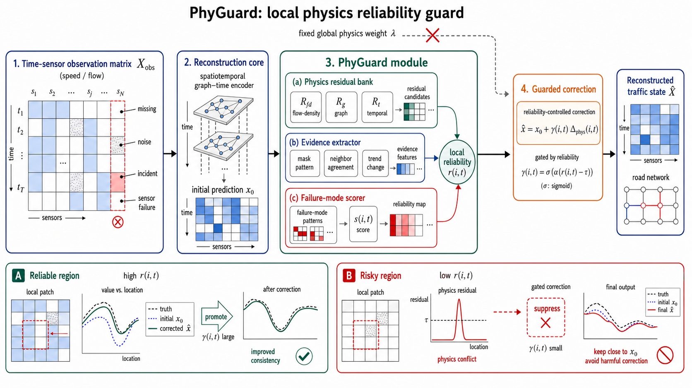
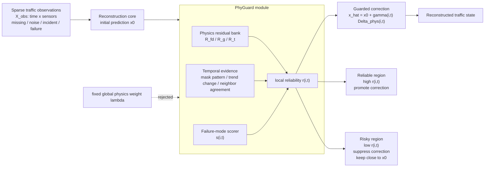

# PhyGuard

**PhyGuard** is a lightweight physics-guided reliability guard for robust sparse
traffic state reconstruction.

The central idea is simple: physics should not always be enforced with a fixed
global loss weight. In open traffic systems, simplified physical assumptions can
be locally unreliable under missing sensors, noisy observations, incidents, and
non-recurrent congestion. PhyGuard converts physics from a globally enforced
constraint into a **local reliability guard** and a **guarded correction signal**.

Working paper title:

> PhyGuard: Physics-Guided Reliability Guard for Robust Sparse Traffic State
> Reconstruction

## Method Overview



PhyGuard is designed as a small correction layer on top of a strong
spatiotemporal reconstruction core. The current research prototype uses a strong
graph-time reconstruction core and adds the following PhyGuard components:

- **Physics residual bank**: builds candidate physical correction signals from
  flow-density, graph smoothness, and temporal consistency residuals.
- **Temporal evidence bank**: extracts local trend, mask pattern, and neighbor
  agreement evidence.
- **Failure-mode scorer**: estimates whether the local region is likely to be
  reliable or risky for physical correction.
- **Region-wise guarded correction**: promotes physical correction in reliable
  regions and suppresses it when physics may harm the reconstruction.

The final correction follows the local form:

```text
x_hat = x0 + gamma(i,t) * Delta_phys(i,t)
```

where `x0` is the initial reconstruction, `Delta_phys(i,t)` is a local physical
correction candidate, and `gamma(i,t)` is controlled by local reliability.

## Mechanism Figure

The mechanism below is the open-source README version of the paper Figure 1.
The publication figure can be redrawn as SVG/TikZ from this structure.



High-resolution concept art used during paper planning was generated locally and
should be manually redrawn before final submission.

## Key Results

All reported values are target-region masked MAE, averaged over 3 seeds. The
main protocol uses 5 datasets, 4 scenarios, and 6 external baselines:
`KNN`, `GRINLite`, `MagiNet`, `SAITS`, `BRITS`, and `ImputeFormer_PyPOTS`.

### Overall Main Result

| Scope | Runs | Best external | PhyGuard | Gain vs best | Wins |
|---|---:|---:|---:|---:|---:|
| 5 datasets x 4 scenarios x 3 seeds | 60 | 0.5316 +/- 0.3762 | 0.4029 +/- 0.3397 | +22.21% | 55/60 |

### Scenario Breakdown

| Scenario | Best external | PhyGuard | Gain vs best | Wins |
|---|---:|---:|---:|---:|
| random_missing_50 | 0.4194 +/- 0.2581 | 0.2438 +/- 0.0793 | +32.73% | 15/15 |
| noise_random_missing | 0.4247 +/- 0.2573 | 0.2626 +/- 0.0760 | +28.18% | 15/15 |
| incident_perturbation | 0.4580 +/- 0.2966 | 0.3000 +/- 0.1182 | +26.31% | 15/15 |
| sensor_failure_30 | 0.8244 +/- 0.5023 | 0.8052 +/- 0.4768 | +1.62% | 10/15 |

Sensor failure is intentionally reported as a modest-gain scenario rather than
the primary claim.

### Ablation

| Variant | Mean MAE | Full gain vs variant |
|---|---:|---:|
| Full PhyGuard | 0.4497 | 0.00% |
| w/o Failure-Mode Guard | 0.4523 | +0.58% |
| w/o Physics Residual Bank | 0.6024 | +25.35% |
| w/o Temporal Evidence Bank | 0.5300 | +15.17% |

The physics residual bank is the strongest ablation evidence that physics is a
core contribution rather than a decorative regularizer.

### Complexity

| Component | Parameters |
|---|---:|
| Strong reconstruction core | 607,785 |
| PhyGuard guard heads | 4,803 |
| Total | 612,588 |
| Extra overhead | 0.79% |

## Repository Structure

```text
configs/       small experiment configurations
data/          dataset loading, masking, corruption, normalization
losses/        metrics and training losses
models/        lightweight baselines and wrappers
physics/       traffic residual definitions and collocation utilities
scripts/       training, evaluation, PhyGuard, baselines, and paper experiments
tests/         smoke tests and unit tests
results/       small local outputs and smoke-test artifacts
```

The primary PhyGuard entry point is:

```text
scripts/run_maginet_physics_guard_quick.py
```

## Installation

This repository targets a conservative Windows + RTX 4060 setup, but the code is
standard Python/PyTorch.

```bash
pip install -r requirements.txt
```

For PyPOTS baselines such as BRITS, SAITS, and ImputeFormer:

```bash
pip install pypots huggingface_hub tables
```

## Quick Start

Run a smoke test on synthetic toy data:

```bash
python reproduce/run_smoke.py
```

Run one PhyGuard quick evaluation:

```bash
python reproduce/run_protocol.py \
  --datasets PEMS08 \
  --scenarios random_missing_50 incident_perturbation \
  --seeds 1 \
  --epochs 20 \
  --guard-epochs 120 \
  --output-root results/reproduce_quick
```

Run the same quick protocol with ImputeFormer:

```bash
python reproduce/run_protocol.py \
  --datasets PEMS08 \
  --scenarios random_missing_50 sensor_failure_30 incident_perturbation noise_random_missing \
  --seeds 1 \
  --include-imputeformer \
  --output-root results/reproduce_quick
```

The direct PhyGuard entry point is still available:

```bash
python scripts/run_maginet_physics_guard_quick.py \
  --dataset PEMS08 \
  --seed 1 \
  --epochs 20 \
  --guard-epochs 120 \
  --scenarios random_missing_50 incident_perturbation \
  --output-dir results/phyguard_pems08_seed1
```

## Data

The code supports:

- `PEMS03`
- `PEMS04`
- `PEMS08`
- `PEMS-BAY`
- `METR-LA`
- `PEMS08_debug`

Traffic datasets are loaded from public sources when available. If a real
dataset is unavailable, early-stage smoke tests use synthetic traffic-like data
only for pipeline validation. Synthetic results must not be treated as paper
evidence.

See `DATASETS.md` and `THIRD_PARTY_NOTICES.md` before redistributing data or
third-party baseline code.

## Evaluation Protocol

The main paper protocol evaluates target-region masked MAE under:

- `random_missing_50`
- `noise_random_missing`
- `incident_perturbation`
- `sensor_failure_30`

Additional robustness experiments use random missing rates 30%, 50%, and 70%.

Formal reproduction scripts are in `reproduce/`.

## Reproducibility Notes

- Main paper tables were aggregated under `C:\tmp\litetrust_paper_tables`.
- Paper planning artifacts were prepared under
  `C:\tmp\phyguard_paper_rewriting_output`.
- The current implementation is a research prototype. Exact paper runs should
  be repeated after finalizing the target journal and code-release branch.

## Citation

If you use this repository, please cite the forthcoming paper:

```bibtex
@misc{phyguard2026,
  title  = {PhyGuard: Physics-Guided Reliability Guard for Robust Sparse Traffic State Reconstruction},
  author = {Anonymous},
  year   = {2026},
  note   = {Manuscript in preparation}
}
```

## License

This repository is prepared for research release. The PhyGuard code can be
released under the MIT License after confirming the licenses of any third-party
backbone code and datasets used in final experiments.

