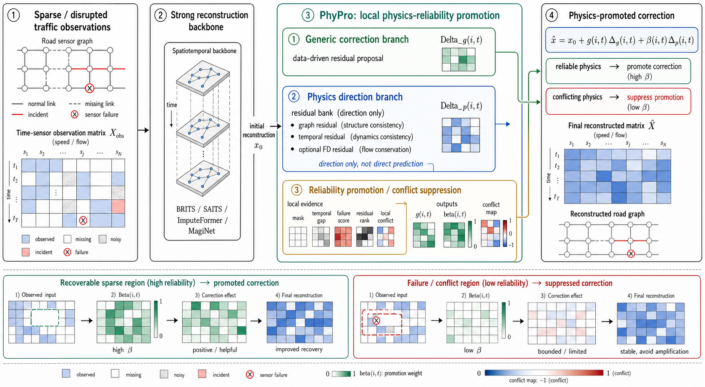
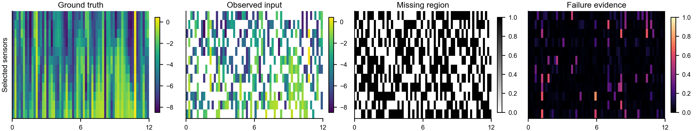
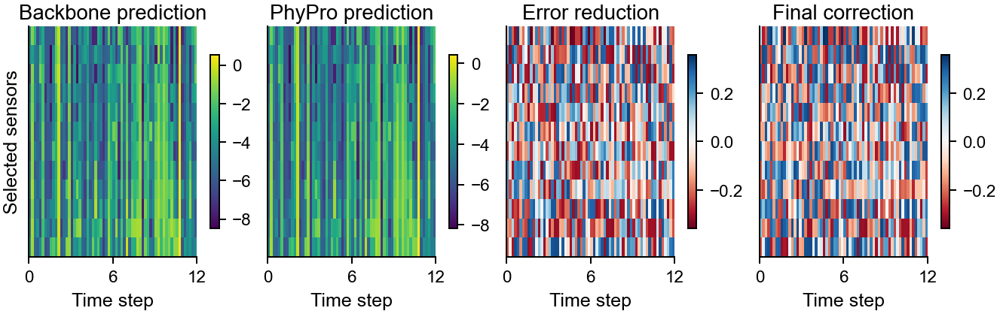
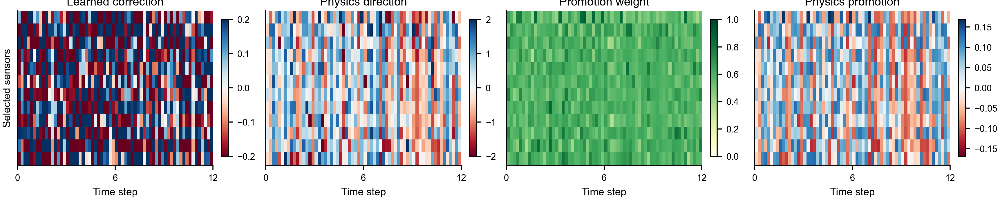

# PhyPro

PhyPro is a lightweight plug-in framework for robust traffic state
reconstruction under sparse and disrupted sensing.

Paper title:

> **PhyPro: Physics-Reliability Promoted Correction for Robust Sparse and
> Disrupted Traffic State Reconstruction**

PhyPro uses physics as local reliability and promotion evidence, not as a fixed
global loss. Given a reconstruction backbone output, it learns a bounded generic
correction, constructs a physics-aligned correction direction, and uses local
reliability, failure, residual, and conflict evidence to decide where physics
should promote or suppress the correction.

Code link:

```text
https://anonymous.4open.science/r/PhyPRO
```

## Citation

If you use this repository, method, or experimental protocol, please cite our
work:

```bibtex
@misc{wang2026phypro,
  title        = {PhyPro: Physics-Reliability Promoted Correction for Robust Sparse and Disrupted Traffic State Reconstruction},
  author       = {Wang, Yi and Shang, Wenqian and Yi, Tong and Zhu, Haibin},
  year         = {2026},
  note         = {Manuscript under review},
  howpublished = {\url{https://anonymous.4open.science/r/PhyPRO}}
}
```

## Method at a Glance

PhyPro applies the following local correction:

```text
x_hat = x0 + g(i,t) * Delta_g(i,t) + beta(i,t) * Delta_p(i,t)
```

where:

- `x0` is the reconstruction from a strong backbone.
- `Delta_g` is a data-driven residual correction proposal.
- `Delta_p` is a physics-aligned direction from graph and temporal residuals.
- `g(i,t)` controls the generic correction.
- `beta(i,t)` decides whether physics should promote or suppress the correction.

Physics is therefore not a direct predictor and not a globally enforced
constraint. It supplies local direction and reliability evidence.

## Paper Figures

### Figure 1: Mechanism



PhyPro attaches a local correction module after a strong reconstruction
backbone. The module combines generic residual correction, physics-aligned
direction, and reliability-conditioned promotion.

### Figure 2(a): Observation and Disruption Evidence



### Figure 2(b): Reconstruction and Error Reduction



### Figure 2(c): Correction, Physics Direction, and Reliability Evidence



## Experimental Scope

The final manuscript evidence evaluates PhyPro on:

- 5 datasets: `PEMS03`, `PEMS04`, `PEMS08`, `PEMS-BAY`, `METR-LA`
- 3 scenarios: `random_missing_50`, `sensor_failure_30`, `incident_perturbation`
- 3 random seeds
- 4 backbones: `BRITS`, `SAITS`, `ImputeFormer`, `MagiNet`

Across 180 paired runs, PhyPro reduces masked MAE from `0.3804` to `0.3441`,
an average reduction of `10.58%` over the corresponding backbones.

## Key Tables

### Backbone + PhyPro

| Backbone | Base masked MAE ↓ | +PhyPro masked MAE ↓ | Average reduction ↑ |
| --- | ---: | ---: | ---: |
| BRITS | 0.3874 ± 0.1254 | **0.3433 ± 0.1296** | 12.80% |
| ImputeFormer | 0.3969 ± 0.2534 | **0.3585 ± 0.2328** | 10.24% |
| MagiNet | 0.3610 ± 0.2236 | **0.3375 ± 0.2169** | 7.76% |
| SAITS | 0.3762 ± 0.1150 | **0.3372 ± 0.1191** | 11.51% |

### Plug-in Comparison

| Method | Overall ↓ | Random ↓ | Failure ↓ | Incident ↓ |
| --- | ---: | ---: | ---: | ---: |
| Backbone | 0.3804 ± 0.1881 | 0.2643 | 0.5930 | 0.2839 |
| Generic Adapter | 0.3496 ± 0.1830 | 0.2309 | 0.5661 | 0.2517 |
| DoRA Adapter | 0.3528 ± 0.1800 | 0.2360 | 0.5642 | 0.2583 |
| Calibration Guard | 0.3556 ± 0.1843 | 0.2375 | 0.5712 | 0.2582 |
| Failure/Anomaly Guard | 0.3550 ± 0.1841 | 0.2372 | 0.5698 | 0.2582 |
| PhyPro | **0.3441 ± 0.1805** | **0.2261** | **0.5583** | **0.2479** |

### Paired Significance Tests

| Comparison | Mean improvement ↑ | Paired t-test p ↓ | Wilcoxon p ↓ |
| --- | ---: | ---: | ---: |
| PhyPro vs Backbone | **10.58%** | **2.29e-54** | **2.73e-31** |
| PhyPro vs Generic Adapter | 1.58% | 1.01e-21 | 7.02e-28 |
| PhyPro vs DoRA Adapter | 2.47% | 6.17e-12 | 6.81e-17 |
| PhyPro vs Calibration Guard | 3.46% | 3.12e-38 | 1.09e-30 |
| PhyPro vs Failure/Anomaly Guard | 3.29% | 8.13e-36 | 1.33e-30 |

### Selected Ablation on PEMS08

| Variant | Masked MAE ↓ | Gate mean ↑ | Promotion mean ↑ |
| --- | ---: | ---: | ---: |
| Backbone | 0.2988 | -- | -- |
| Generic correction only | 0.2863 | 1.0000 | -- |
| Full PhyPro | **0.2786** | 0.9566 | 0.4872 |
| w/o physics promotion | 0.2789 | 0.9567 | 0.0779 |
| w/o residual/evidence bank | 0.2975 | 0.9682 | 0.3322 |
| w/o conflict suppression | 0.2788 | 0.9572 | 0.5500 |
| w/o failure evidence | 0.2786 | 0.9568 | 0.5230 |

### Region-level Mechanism Statistics

| Region | Masked MAE ↓ | Reliability gate ↑ | Promotion mean ↑ | \|Delta_g\| mean ↓ | Failure score ↑ |
| --- | ---: | ---: | ---: | ---: | ---: |
| Random missing | **0.2261** | 0.9503 | 0.5264 | **0.0757** | 0.0764 |
| Sensor failure | 0.5583 | 0.9545 | 0.5512 | 0.1185 | 0.7825 |
| Incident/disrupted | 0.2479 | 0.9503 | 0.5233 | 0.0759 | 0.0764 |

### Missing-rate Robustness

| Missing rate | Backbone ↓ | Generic Adapter ↓ | Calibration Guard ↓ | Failure/Anomaly Guard ↓ | PhyPro ↓ |
| --- | ---: | ---: | ---: | ---: | ---: |
| 30% | 0.3173 ± 0.1124 | 0.2960 ± 0.1020 | 0.3019 ± 0.1050 | 0.3051 ± 0.1072 | **0.2815 ± 0.0974** |
| 50% | 0.3317 ± 0.1140 | 0.3097 ± 0.1035 | 0.3147 ± 0.1065 | 0.3160 ± 0.1078 | **0.2988 ± 0.1002** |
| 70% | 0.3583 ± 0.1164 | 0.3372 ± 0.1085 | 0.3422 ± 0.1109 | 0.3427 ± 0.1113 | **0.3307 ± 0.1080** |

### Complexity

PhyPro adds `23,365` trainable parameters for all datasets.

| Dataset | Nodes | Extra forward time (ms) ↓ |
| --- | ---: | ---: |
| PEMS03 | 358 | 2.52 |
| PEMS04 | 307 | 1.93 |
| PEMS08 | 170 | **0.99** |
| PEMS-BAY | 325 | 2.11 |
| METR-LA | 207 | 1.21 |

## Key Files

```text
paper/main.tex
paper/references.bib
paper/figures/figure_phypro_mechanism.png
paper/figures/figure_phypro_case_a.png
paper/figures/figure_phypro_case_b.png
paper/figures/figure_phypro_case_c.png
reproduce/run_plugin_baseline_comparison.py
reproduce/run_phypro_ablation.py
reproduce/create_phypro_visual_case.py
METHOD_PHYPRO_FROZEN.md
```

Paper evidence files:

```text
results/phypro_paper_evidence/phypro_significance_tests.csv
results/phypro_paper_evidence/phypro_significance_tests_masked_mae.csv
results/phypro_paper_evidence/phypro_complexity_table.csv
results/phypro_paper_evidence/phypro_region_explainability_minimal_no_gain.csv
results/phypro_paper_evidence/phypro_param_sensitivity_no_gain.csv
results/phypro_paper_evidence/phypro_ablation_selected.csv
results/phypro_missing_rate_robustness_quick/missing_rate_robustness_pivot_masked_mae.csv
results/paper_tables/dora_adapter_full_5data_3scen_3seed_4backbones.csv
results/paper_tables/phypro_vs_dora_paired.csv
```

## Quick Reproduction

Run a small plug-in comparison:

```bash
python reproduce/run_plugin_baseline_comparison.py \
  --datasets PEMS08 \
  --scenarios random_missing_50 \
  --seeds 1 \
  --backbones SAITSStrong MagiNetStrong \
  --epochs 20 \
  --plugin-epochs 20 \
  --train-samples 64 \
  --val-samples 16 \
  --test-samples 16 \
  --phypro-gate-floor 0.95 \
  --phypro-conflict-coef 0.75 \
  --output-dir results/phypro_smoke
```

Generate the visual case used in the manuscript:

```bash
python reproduce/create_phypro_visual_case.py \
  --dataset PEMS-BAY \
  --scenario random_missing_50 \
  --seed 1 \
  --epochs 50 \
  --plugin-epochs 40 \
  --phypro-gate-floor 0.95 \
  --phypro-conflict-coef 0.75 \
  --output-dir results/phypro_visual_case
```

## Datasets

The code uses public traffic benchmark sources. Raw datasets are not
redistributed in this repository. Users should follow the licenses and terms of
the original dataset providers for:

- `PEMS03`, `PEMS04`, `PEMS08`
- `PEMS-BAY`
- `METR-LA`

## Notes

Use `PhyPro` in paper-facing text. Internal names such as `PhyGuardRC`, `V12`,
or old `PhyGuard` experiment labels are historical development artifacts and
should not be used as final method names.
